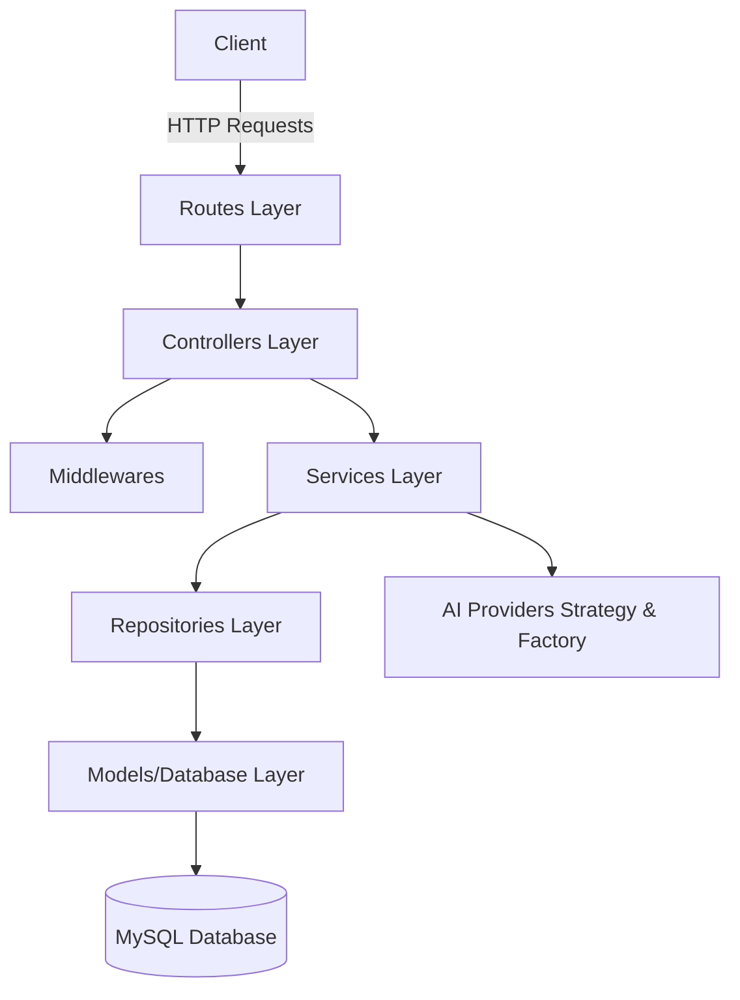

# Project Folder Structure & Architecture

This document provides a comprehensive overview of the folder structure, architecture, and module organization of the project.

The backend is built using **Node.js**, **Express**, and **TypeScript** (migrating from JavaScript), using **Sequelize** as the ORM to interact with a MySQL database. It also integrates with external services like Firebase Admin SDK and various AI/LLM providers (OpenAI, Sarvam AI, etc.).

---

## High-Level Architecture

The project follows a layered architecture combined with clean, decoupled design patterns for external services:

1. **Routing Layer**: Dispatches endpoints to the appropriate controllers.
2. **Middleware Layer**: Handles cross-cutting concerns (authentication, rate-limiting, uploads, tracing, auditing).
3. **Controller Layer**: Handles API request/response parsing, schema validation, and delegates business logic to services.
4. **Service Layer**: Houses the core business logic, orchestrating database transactions, external system communication, and algorithms.
5. **Repository Layer**: Acts as an abstraction layer over Sequelize models to decouple data access patterns.
6. **Model Layer**: Defines database tables, attributes, schemas, and relations.
7. **Strategy / Adapter Pattern**: Decouples third-party LLM, STT, and TTS engines from the core application, allowing simple provider switching.

---

## Detailed Directory Map

### 1. Root Directories & Configuration Files

*   [config.env](file:///workspaces/admin-backend-main/config.env): Environment variables configuration.
*   [package.json](file:///workspaces/admin-backend-main/package.json): NPM dependency manifest and start scripts.
*   [tsconfig.json](file:///workspaces/admin-backend-main/tsconfig.json): TypeScript configuration options.
*   [schools2ai-firebase-adminsdk.json](file:///workspaces/admin-backend-main/schools2ai-firebase-adminsdk.json): Firebase admin credentials.
*   [dist/](file:///workspaces/admin-backend-main/dist): Build folder containing the compiled JavaScript output.
*   [public/](file:///workspaces/admin-backend-main/public): Serves static files.
*   [uploads/](file:///workspaces/admin-backend-main/uploads): Local temporary storage used by `multer` for handling uploaded files (e.g. PDFs, images) before cloud processing.
*   [test/](file:///workspaces/admin-backend-main/test): Holds automated test suites written with `vitest`.
    *   [appFeedbackController.test.js](file:///workspaces/admin-backend-main/test/appFeedbackController.test.js)
    *   [register.service.test.ts](file:///workspaces/admin-backend-main/test/register.service.test.ts)

---

### 2. Source Directory (`/src`)

All source code is organized within the [src](file:///workspaces/admin-backend-main/src) folder:

#### Entry Points
*   [src/index.js](file:///workspaces/admin-backend-main/src/index.js): The application startup script. Sets up Express, error handling, CORS, body parsers, cookie parsers, routes, database connections, and spins up the server.
*   [src/bootstrap.js](file:///workspaces/admin-backend-main/src/bootstrap.js): Script containing initialization code logic.

#### Configurations
*   [src/config/db.js](file:///workspaces/admin-backend-main/src/config/db.js): Legacy JavaScript database setup.
*   [src/configs/](file:///workspaces/admin-backend-main/src/configs): Contains active TS configuration profiles:
    *   [database/db.ts](file:///workspaces/admin-backend-main/src/configs/database/db.ts): Database credentials/options configuration.
    *   [firebase/firebaseConfig.ts](file:///workspaces/admin-backend-main/src/configs/firebase/firebaseConfig.ts): Firebase Admin SDK connection setup.

#### Routes (`src/routes`)
Defines the HTTP endpoints. Each file maps routes to specific controllers:
*   [admin.routes.js](file:///workspaces/admin-backend-main/src/routes/admin.routes.js)
*   [auth.routes.js](file:///workspaces/admin-backend-main/src/routes/auth.routes.js)
*   [student.routes.js](file:///workspaces/admin-backend-main/src/routes/student.routes.js)
*   [teacher.routes.js](file:///workspaces/admin-backend-main/src/routes/teacher.routes.js)
*   [notification.routes.ts](file:///workspaces/admin-backend-main/src/routes/notification.routes.ts)
*   [giniRouter.routes.ts](file:///workspaces/admin-backend-main/src/routes/giniRouter.routes.ts) (AI Assistant routes)
*   [predictPapers.router.ts](file:///workspaces/admin-backend-main/src/routes/predictPapers.router.ts)

#### Controllers (`src/controllers`)
Processes requests, validates request payloads, and sends back appropriate HTTP responses using helper functions:
*   [auth.controller.ts](file:///workspaces/admin-backend-main/src/controllers/auth.controller.ts)
*   [course.controller.js](file:///workspaces/admin-backend-main/src/controllers/course.controller.js)
*   [student.controller.js](file:///workspaces/admin-backend-main/src/controllers/student.controller.js)
*   [teacher.controller.js](file:///workspaces/admin-backend-main/src/controllers/teacher.controller.js)
*   [chatbot.controller.ts](file:///workspaces/admin-backend-main/src/controllers/chatbot.controller.ts)
*   [generatePracticeQuestions.controller.ts](file:///workspaces/admin-backend-main/src/controllers/generatePracticeQuestions.controller.ts)
*   [predictPapers.controller.ts](file:///workspaces/admin-backend-main/src/controllers/predictPapers.controller.ts)

#### Middlewares (`src/middlewares`)
Interceptors for Express requests:
*   [auth.middleware.ts](file:///workspaces/admin-backend-main/src/middlewares/auth.middleware.ts): Verifies JWT tokens and attaches authenticated users to the request context.
*   [rateLimiteWithToken.ts](file:///workspaces/admin-backend-main/src/middlewares/rateLimiteWithToken.ts): Implements token-based API rate limiting.
*   [multer.middleware.js](file:///workspaces/admin-backend-main/src/middlewares/multer.middleware.js) & [upload.middleware.js](file:///workspaces/admin-backend-main/src/middlewares/upload.middleware.js): Handle file upload parsing.
*   [aiLogger.middleware.js](file:///workspaces/admin-backend-main/src/middlewares/aiLogger.middleware.js) & [tutorLogs.middleware.ts](file:///workspaces/admin-backend-main/src/middlewares/tutorLogs.middleware.ts): Middleware for logging AI API interactions and usage metrics.

#### Services (`src/services`)
Contains all business logic. Controllers call services to execute user tasks:
*   [auth.service.ts](file:///workspaces/admin-backend-main/src/services/auth.service.ts): Handles user session generation, token minting, and password encryption.
*   [profile.service.ts](file:///workspaces/admin-backend-main/src/services/profile.service.ts): Manages profile updating logic.
*   [predictPapers.service.ts](file:///workspaces/admin-backend-main/src/services/predictPapers.service.ts): Generates paper predictions using LLMs.
*   [notification.service.ts](file:///workspaces/admin-backend-main/src/services/notification.service.ts): Formulates and delivers push notifications via Firebase.

#### Repositories (`src/repositories`)
Data access layers isolating database queries from the service logic:
*   [user.repository.ts](file:///workspaces/admin-backend-main/src/repositories/user.repository.ts): CRUD operations for the user profile.
*   [school.repository.ts](file:///workspaces/admin-backend-main/src/repositories/school.repository.ts): Operations related to school records.
*   [notification.repository.ts](file:///workspaces/admin-backend-main/src/repositories/notification.repository.ts): Interacts with notification storage.

#### Models (`src/models`)
Defines the database schema using Sequelize ORM:
*   [index.js](file:///workspaces/admin-backend-main/src/models/index.js): Orchestrates all model attachments and database connection initialization.
*   [user.model.ts](file:///workspaces/admin-backend-main/src/models/user.model.ts)
*   [admin_school.model.ts](file:///workspaces/admin-backend-main/src/models/admin_school.model.ts)
*   [teacher_profile.model.ts](file:///workspaces/admin-backend-main/src/models/teacher_profile.model.ts)
*   [student_profile.model.ts](file:///workspaces/admin-backend-main/src/models/student_profile.model.ts)
*   [assessment.model.js](file:///workspaces/admin-backend-main/src/models/assessment.model.js)

#### Clean Interfaces / Adaptability (`src/interface` & `src/interface_imp`)
These folders decouple the platform from vendor lock-in with custom AI providers using the Strategy and Factory design patterns:

*   **Interfaces (`src/interface/`)**:
    *   [LLMStrategy.ts](file:///workspaces/admin-backend-main/src/interface/strategy/LLMStrategy.ts): Strategy interface for large language model operations.
    *   [TTSStrategy.ts](file:///workspaces/admin-backend-main/src/interface/strategy/TTSStrategy.ts) & [STTStrategy.ts](file:///workspaces/admin-backend-main/src/interface/strategy/STTStrategy.ts): Interface strategy definitions for Text-to-Speech and Speech-to-Text.
    *   [StreamAdapter.ts](file:///workspaces/admin-backend-main/src/interface/adapter/StreamAdapter.ts) & [LLMStreamAdapter.ts](file:///workspaces/admin-backend-main/src/interface/adapter/LLMStreamAdapter.ts): Base interface structure for streaming completions.

*   **Implementations & Factories (`src/interface_imp/`)**:
    *   `strategy/`: Implementations of strategies, such as [OpenAIProvider.ts](file:///workspaces/admin-backend-main/src/interface_imp/strategy/OpenAIProvider.ts), [SarvamSTTProvide.ts](file:///workspaces/admin-backend-main/src/interface_imp/strategy/SarvamSTTProvide.ts), and [SarvamTTSProvide.ts](file:///workspaces/admin-backend-main/src/interface_imp/strategy/SarvamTTSProvide.ts).
    *   `factory/`: Decides dynamically which strategy to instantiate based on request parameters/configuration. e.g., [LLMFactory.ts](file:///workspaces/admin-backend-main/src/interface_imp/factory/LLMFactory.ts), [STTFactory.ts](file:///workspaces/admin-backend-main/src/interface_imp/factory/STTFactory.ts), [TTSFactory.ts](file:///workspaces/admin-backend-main/src/interface_imp/factory/TTSFactory.ts).
    *   `adapter/`: Adapters transforming data flow/chunks for front-end consumption, such as [OpenAIStreamAdapter.ts](file:///workspaces/admin-backend-main/src/interface_imp/adapter/OpenAIStreamAdapter.ts).

#### Utilities & Error Handling (`src/utils`, `src/error`, `src/type`)
*   [src/error/](file:///workspaces/admin-backend-main/src/error): Global Express error framework.
    *   [AppError.ts](file:///workspaces/admin-backend-main/src/error/AppError.ts): Standard application exception class.
    *   [globalErrorHandler.ts](file:///workspaces/admin-backend-main/src/error/globalErrorHandler.ts): Catch-all Express middleware converting unhandled errors to standard JSON API responses.
*   [src/utils/](file:///workspaces/admin-backend-main/src/utils): Reusable helper files:
    *   [ApiError.js](file:///workspaces/admin-backend-main/src/utils/ApiError.js) & [ApiResponse.js](file:///workspaces/admin-backend-main/src/utils/ApiResponse.js): Formatting structures for API payload consistency.
    *   [asyncHandler.js](file:///workspaces/admin-backend-main/src/utils/asyncHandler.js): Wrapper eliminating `try/catch` boilerplate in Express async route handlers.
    *   [s3Upload.js](file:///workspaces/admin-backend-main/src/utils/s3Upload.js) & [signedUrl.js](file:///workspaces/admin-backend-main/src/utils/signedUrl.js): AWS S3 operations.
    *   [otp.util.js](file:///workspaces/admin-backend-main/src/utils/otp.util.js): Core logic for generating/validating OTP codes.
*   [src/type/type.d.ts](file:///workspaces/admin-backend-main/src/type/type.d.ts): Shared TypeScript declarations.
